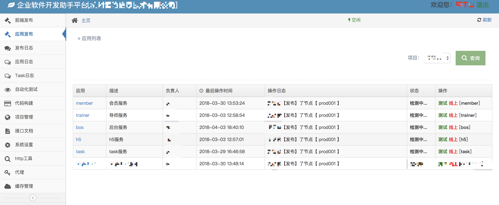
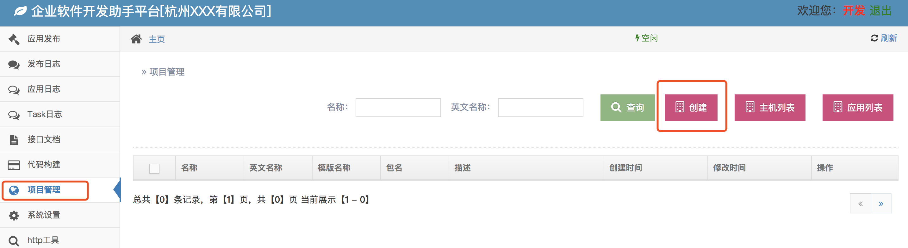
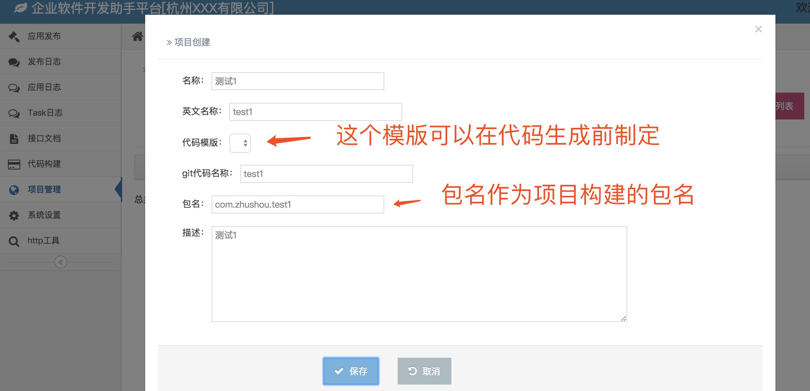
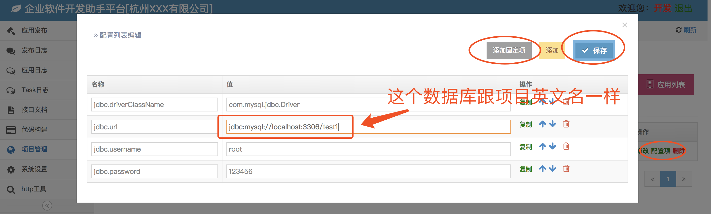

# 企业软件开发助手管理平台

## 目标

> 一个软件开发公司在进行软件开发的时候，最好能有一个辅助软件的开发的工具，让开发人员更多的时间去关注业务，
让代码构建，测试，联调，编译部署，生产监控都让外围工具帮你搞定，这个工具平台贯穿软件开发的生命周期的每一个环节，
彻底解放程序猿的劳动力。

## 功能说明

* 项目管理
* 代码构建
* 接口文档管理
* 编译发布（前端 AND 后台）
* 日志管理（应用 AND task）
* 自动化测试
* Http工具



## 使用说明

> 本工具平台的各个功能通过配置能单独跟你的业务打通，但最好整套（从代码构建到生产部署）直接利用

## 安装

### 配置环境
* jdk 1.7 或以上
* maven 3.x
* redis 3.x
* mysql 5.6 或以上
* git clone git@github.com:tss0823/zhushou.git
* 将项目根目录数据库脚本[/zhushou_init.sql](zhushou_init.sql)导入数据库(自己创建一个库)中
* 配置好配置文件[/conf/config.properties](conf/config.properties)
```
jdbc.driverClassName=com.mysql.jdbc.Driver
jdbc.url=jdbc:mysql://localhost:3306/zhushou_init
jdbc.username=root
jdbc.password=123456
redis.host=localhost
redis.port=6389
redis.pwd=zhushou123
redis.namespace=zhushou_dev
```
mysql,redis 根据自己环境来配置，其他的默认就好

### 编译 AND 运行
1. sh compile.sh 
2. sh run.sh deploy
3. sh run.sh client

admin 表示管理，管理端负责用户的交互。client 表示客户端，客户端主要管理服务器节点。

## 详细使用流程

### 登录
#### 用户账号
* 管理员 admin/123456
* 开发   dev/123456
* 前端   front/123456
* 测试   test/123456

默认deploy的访问地址
[http://localhost:1027/index.html](http://localhost:1027/index.html)


### 项目管理
流程
> 创建项目 > 创建主机 > 创建应用

#### 项目
> 项目是根据业务来，一个项目包含很多应用，而应用可以展现在不同的端（pc,mobile）



项目的创建英文名称很重要，最好在公司层面是唯一的这样就不会混淆，代码模版是成成代码所需，后续介绍版本的时候详细说明，
包名也是生成代码的项目工程的java包名。


配置项是针对项目的配置文件的key-value变量，其中包括数据库，缓存等配置，用户可以根据自己的业务配置这个。


#### 主机
主机的元素包括

#### 应用

### 代码构建

### 编译部署

### 日志跟踪

### 接口文档

### 其他功能

## 环节业务整合


